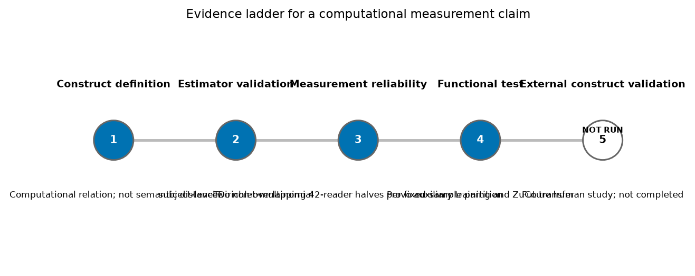
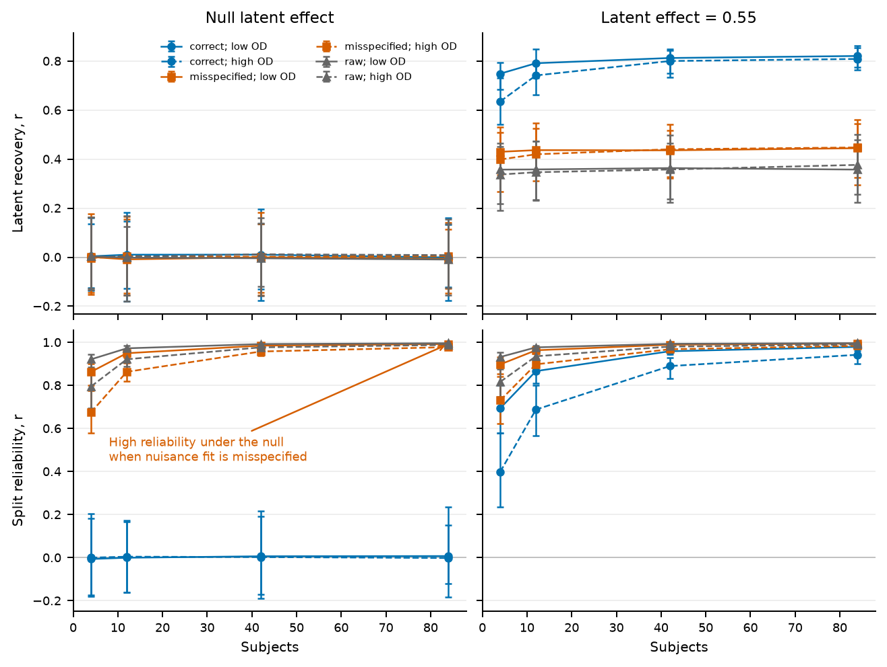
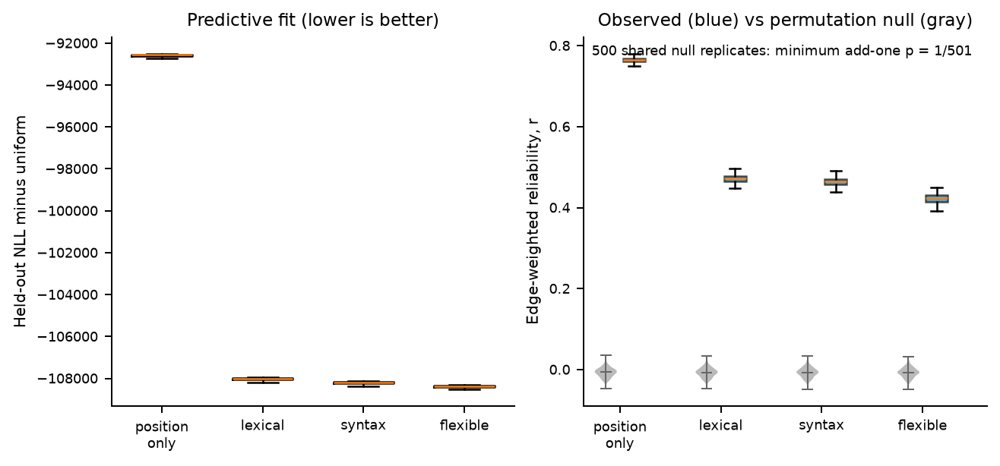
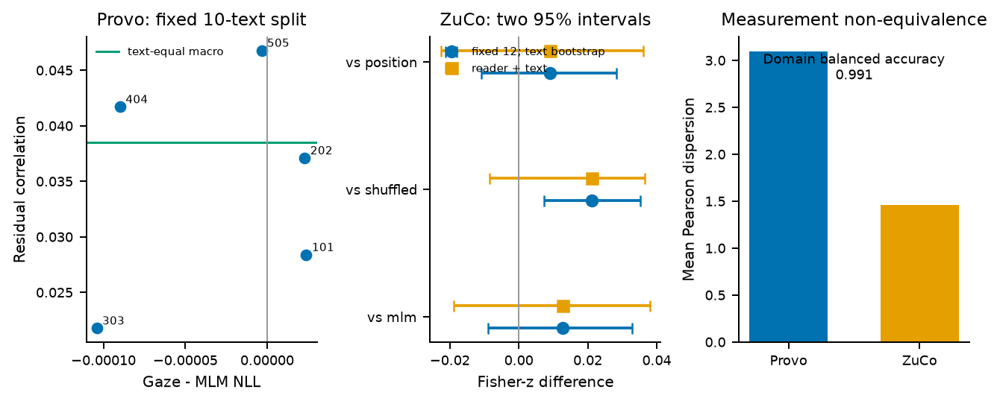

# The Reliability Paradox in Forward Target Selection: Measurement-Conditioned Cognitive Supervision in Natural Reading

## Abstract

We study destination allocation conditional on the next retained transition being forward, within-sentence, and within-line. In simulation, omitted stable nuisance produced high half-sample pattern correlation despite near-zero latent recovery. Across 100 randomized partitions of the fixed 84-reader Provo sample, median text-level edge-pattern correlation was .765 under position-only adjustment and .472, .465, and .423 under lexical, syntax, and flexible specifications. Lexical, syntax, and flexible achieved lower event-weighted held-out destination loss. On one fixed 10-text split, gaze supervision had a small positive text-level association with held-out residuals but no detectable masked-language-model benefit. In ZuCo, reader-and-text uncertainty intervals for all three gaze-minus-control contrasts crossed zero. A secondary decomposition found greater observed mass and reproducibility at adjacent and near than sparse far destinations, but this gradient was measurement-sensitive. Thus reproducibility, predictive adequacy, construct-preserving adjustment, utility, and transport require separate evidence.

**Keywords:** eye tracking; reliability; cognitive supervision; specification curve; natural reading; behavioral signals; negative results

## Introduction

This study's estimand is **destination allocation conditional on the next retained transition being forward, within-sentence, and within-line**. It describes allocation among formally eligible destinations, not whether a fixation is followed by a forward movement. E-Z Reader links lexical processing to saccade programming under largely serial attention, whereas SWIFT allows graded parallel lexical activation; both treat gaze as a joint outcome of processing state and oculomotor control rather than a direct trace of a linguistic relation (Reichle et al., 1998, 2003; Engbert et al., 2005). Word visibility, fixation location, target accessibility, execution noise, direction, and line layout all constrain fixation sequences (Rayner, 1998).

A forward transition is not a transparent readout of language processing. Landing positions follow stable spatial regularities and depend on launch conditions (Rayner, 1979; McConkie et al., 1988; Vitu et al., 1990). Skipping varies with word length, frequency, predictability, and target planning (Drieghe et al., 2005; Rayner et al., 2011), while return sweeps constitute a distinct layout-sensitive targeting problem (Slattery & Vasilev, 2019). Frequency and predictability also alter fixation behavior without making any one measure process-specific (Ehrlich & Rayner, 1981; Rayner et al., 2004a; Staub, 2015). The same pattern can arise from linguistic processing, gaze geometry, or their interaction; forward progression alone does not identify integration, prediction, or semantic relatedness.

This many-to-one mapping creates a **reliability paradox**. Behavioral supervision should reproduce across comparable reader samples, yet stable nuisance structure also reproduces. A residual model that includes additional relevant predictors can remove shared predictable variance and lower residual correlation relative to a model that omits them. Reliability is necessary but cannot certify purity or validity. This use extends, but is not identical to, the individual-differences paradox: our estimand concerns aggregate directed edges, not stable person-level traits (Hedge et al., 2018; Rouder & Haaf, 2019; Parsons et al., 2019).

The same discipline is required when behavior supervises a computational model. Human origin, target reproducibility, predictive adequacy, nuisance coverage, construct-preserving adjustment, target learnability, functional utility, and cross-corpus performance are separate links in an inference chain. Gaze can evaluate representations, be compared with model attention, and train or augment language models (Søgaard, 2016; Hollenstein et al., 2019; Eberle et al., 2022; Deng et al., 2023a, 2023b, 2024). It does not follow that a learnable human-derived target contributes information beyond text or position, nor that model-behavior alignment establishes a shared mechanism.

We ask four questions: **RQ1**, can pattern reproducibility diverge from latent recovery under omitted nuisance? **RQ2**, how do held-out destination NLL, half-sample pattern correlation, and residual identity vary across observational specifications? **RQ3**, is the Provo residual association learnable, and does supervision lower held-out MLM NLL? **RQ4**, does a Provo-trained scorer outperform shuffle, MLM-only, and position controls in ZuCo under combined domain and measurement change?

The contributions are a formally bounded conditional-destination estimand; an existence-proof simulation separating reproducibility from latent recovery; a specification analysis that separates predictive adequacy, nuisance coverage, and construct-preserving adjustment; and controlled within- and cross-corpus tests that distinguish learnability from utility. E-Z Reader and SWIFT motivate the coupled framing, but this study is not a model comparison and estimates no parameter of either theory.

## Related Work

### Eye-movement control and formally eligible destinations

Models and experiments jointly show that lexical state, launch geometry, landing location, skipping, and line layout constrain reading behavior (Rayner, 1979, 1998; McConkie et al., 1988; Vitu et al., 1990; Reichle et al., 2003; Engbert et al., 2005; Drieghe et al., 2005; Slattery & Vasilev, 2019). These findings motivate the conditional risk set; they do not identify the residual as a linguistic construct.

### Reliability, residualization, and specification

Reliability and validity are distinct, and a coefficient is meaningful only relative to its sampling and measurement design (Hedge et al., 2018; Rouder & Haaf, 2019; Parsons et al., 2019). Residualization changes the question answered by a predictor but does not by itself identify the residual as a construct (Wurm & Fisicaro, 2014). We therefore compare a bounded set of observational specifications rather than selecting one by maximum reliability. This follows the transparency rationale of multiverse and specification-curve analyses, without claiming to enumerate every reasonable analysis (Steegen et al., 2016; Simonsohn et al., 2020). Out-of-fold prediction prevents a text's outcomes from directly determining its own predictions, but it cannot address omitted-variable bias.

### Gaze and computational supervision

Eye tracking has been used to evaluate representations, compare attention patterns, generate scanpaths, and supervise language models (Søgaard, 2016; Hollenstein et al., 2019; Eberle et al., 2022; Bolliger et al., 2023; Deng et al., 2023a, 2023b, 2024). Predictive performance and explanatory adequacy are distinct goals (Shmueli, 2010). This literature therefore motivates separate tests of target association, downstream prediction, and construct interpretation rather than treating any one as evidence for the others.

### Cross-corpus measurement and transport

Provo and ZuCo support natural-reading analyses with different readers, texts, tasks, layouts, and exposure (Luke & Christianson, 2018; Hollenstein et al., 2018). Psycholinguistic generalization requires attention to both sampled participants and sampled linguistic materials (Clark, 1973; Baayen et al., 2008). We evaluate a transported scorer while refitting the criterion nuisance model locally, but do not estimate a generalizability-theory coefficient. Measurement invariance requires a formal sequence of model-based tests (Vandenberg & Lance, 2000; Putnick & Bornstein, 2016); our comparison only describes observable differences in measurement conditions.

**Figure 1 about here.**

## Theoretical and Measurement Framework

### Reading as constrained target selection

We use **population-level conditional destination allocation** for the aggregate allocation among formally eligible destinations, conditional on the next retained transition being forward, within-sentence, and within-line. This is a conditional edge pattern, not a reader trait or an individual saccade-program parameter. E-Z Reader and SWIFT disagree about attentional allocation but agree that lexical state and eye-movement control jointly constrain gaze (Reichle et al., 2003; Engbert et al., 2005). Spatial landing regularities, word skipping, and line-return control make destination geometry constitutive of the phenomenon (McConkie et al., 1988; Drieghe et al., 2005; Slattery & Vasilev, 2019).

**Linguistically modulated target selection** is a candidate boundary framework, not an identified residual construct. Lexical accessibility, contextual predictability, and sentence processing can modulate eye movements (Kliegl et al., 2006; Rayner et al., 2004a; Clifton et al., 2007), but the present observational residual does not isolate any one source.

### What forward transitions can and cannot indicate

An adjacent transition records progressive allocation to the next token, whereas a nonadjacent transition records a skip-like target choice. Either may be sensitive to language processing, but sensitivity is not specificity. Skipping does not establish completed processing of a skipped word, and token separation is not visual angle, launch-site distance, or true saccade amplitude. Regressions and refixations may be informative about difficulty or reanalysis in designs that measure them, but they are outside the present forward risk set; even experimentally induced regressions do not make ordinary forward movement a marker of successful integration (Frazier & Rayner, 1982; Clifton et al., 2007). Independent manipulations are needed to attribute plausibility or related higher-level processing (Rayner et al., 2004b).

### From observed transitions to a residual relation

For a source word *i* in a text, the risk set contains forward destination words *j* that are in the same sentence and on the same reconstructed display line. The observed quantity is a count, aggregated over readers, of consecutive valid fixations moving from *i* to *j*. A conditional multinomial nuisance model assigns probabilities to all eligible destinations for each source. The model is fitted without the target text and yields an expected edge count. The empirical target is the raw, unclipped Pearson residual for each eligible directed edge. It is therefore conditional on the risk-set definition, reader aggregation, feature specification, regularization, and cross-fitting scheme.

Each of these choices is constitutive of the measurement. Restricting the risk set only after fitting would allow invalid alternatives to influence the normalization and fitted coefficients. Treating unobserved destinations as absent would select edges on the outcome. Sharing a nuisance fit across reader halves could create dependence between nominally independent reliability estimates. Fitting and evaluating a baseline on the same texts could absorb text-specific noise or leak outcomes into expected counts. Our primary pipeline consequently uses the same risk set for candidate construction, counts, nuisance fitting, residualization, auxiliary training, and transfer evaluation; retains all eligible destination cells for exposed sources; fits each reader half independently; and predicts each text out of fold.

Cross-fitting addresses one problem but not all problems. Sample splitting can limit overfitting bias from learned nuisance functions (Chernozhukov et al., 2018); here, it specifically prevents a text's outcomes from directly determining their own nuisance predictions. We do not import the causal or structural-parameter guarantees of double machine learning. Cross-fitting does not make an omitted variable appear, guarantee the functional form, or establish that the remaining residual corresponds to a psychological construct. This distinction motivates both simulation and specification analysis.

### Reliability under residualized measurement

We define **specification-conditioned behavioral regularity** as the reproducibility and content of a behavioral structure conditional on its risk set, nuisance model, residual definition, aggregation, and weighting. Our split-half reliability asks whether two non-overlapping 42-reader halves within each randomized partition of the fixed sample assign similar residual values to the same eligible directed edges under one such specification. This is not an immutable trait, causal parameter, semantic agreement, or individual-difference reliability (Hedge et al., 2018; Rouder & Haaf, 2019). We report edge-weighted, source-equal flatten, and per-source Fisher-equal summaries because each emphasizes a different part of the relation; none is a universal coefficient.

The reliability paradox follows from a simple decomposition. Suppose an observed transition relation contains a stable nuisance component, a stable target component, and sample-specific variation. A residual estimator that omits part of the stable nuisance leaves that component in both halves. Its agreement can be high even if the target component is absent. An estimator that includes the omitted nuisance term can remove that shared nuisance under the stated data-generating process, leaving a smaller target plus more prominent sampling variation, and thereby reduce correlation. Consequently, high reliability can indicate successful preservation of a target, successful preservation of nuisance, or both. Held-out nuisance prediction and specification comparisons are needed to distinguish these possibilities.

### From behavioral alignment to cognitive supervision

Cognitive supervision is an inference chain rather than a procedural checklist. **Reproducibility** describes agreement of a defined pattern across reader halves. **Predictive adequacy** is indexed here by lower held-out destination NLL and says only that destination counts are predicted better. **Nuisance coverage** concerns which competing determinants are represented. **Construct-preserving adjustment** requires independent evidence that adjustment removes nuisance without removing or creating the intended construct. None of the observational specifications identifies which residual is construct-valid. **Target learnability**, **functional utility**, and **cross-corpus performance** are further distinct outcomes.

Evidence can branch rather than rise monotonically. A signal may be reproducible and functionally useful without having a settled psychological interpretation. It may align with a human construct but fail to improve MLM because the objective already captures relevant information, the auxiliary weight is unsuitable, or the training horizon is short. It may work in one corpus but not transport because the corpus changes the measurement geometry. The framework therefore prohibits several common shortcuts: reliability is not construct validity; auxiliary learnability is not utility; and source-domain performance is not cross-corpus generalization.

The framework also clarifies the role of null results. A null at one level does not erase evidence at another. Failure to improve MLM does not show that gaze contains no cognitive information. Failure to exceed controls in ZuCo does not negate Provo reproducibility. Instead, these findings locate where the evidence ladder currently stops. The resulting bounded claim can be more theoretically useful than a broad but underidentified positive claim.

## Methods

### Overview and analysis status

This was a computational secondary analysis of existing eye-tracking corpora plus simulation. No new participants were recruited and no new human judgments were collected. The primary empirical pipeline was frozen as forward, same-sentence, same-line (`common_forward_same_sentence_same_line`) before the reported specification, functional, and transfer conclusions. Earlier mixed-risk analyses are superseded and are not used as evidence here. Unless noted otherwise, stochastic analyses used seed 20260711. Optimization seeds were 101, 202, 303, 404, and 505.

### Simulation

The simulation tested estimator behavior where the latent relation was known. Each replicate generated 30 source groups, each with six candidate destinations. Destination logits were

`0.8 * x1 - 0.9 * x2 + delta * z`,

where `x1` and `x2` were observed nuisance features, `z` was the latent relation feature, and `delta` was 0 or 0.55. For every subject and source, a subject-specific probability vector was drawn from a Dirichlet distribution centered on the logits, after which 24 events were sampled multinomially. Dirichlet concentrations of 120 and 8 represented lower and higher overdispersion. The grid crossed 4, 12, 42, and 84 subjects; both latent-effect values; and both concentration values, with 80 independently generated replicates per cell. The fixed seed was 20260711.

Subjects were randomly divided into two halves. The `raw` estimator subtracted uniform destination probability from row-normalized counts and removed neither nuisance. The `correct` estimator fitted a regularized conditional multinomial model with both `x1` and `x2`, separately in each half; every prediction was out of source fold, and generating coefficients were not supplied. The `misspecified` estimator used the same independent fitting and cross-fitting but omitted `x2`. Correlation between estimated edge values and `z` measured latent recovery. Correlation between half-specific edge residual vectors measured split-half reliability. The replicate was the inferential unit. Under `delta = 0`, we also summarized `Pr(|r| > .2)` descriptively; this threshold was not treated as a calibrated significance test.

### Corpora and participants

Provo contains natural reading data and predictability norms (Luke & Christianson, 2018). The analysis included 84 readers and all 55 texts. Official files were obtained from the documented OSF source under CC BY 4.0 and verified by SHA-256. The conversion began with 228,883 fixation rows from 4,620 trials. The final strict-line file contained 218,947 rows after documented exclusions, including 3,624 rows from trials absent from the word table, 5,703 outside-AOI rows, 386 rows without a one-to-one AOI mapping, and 223 rows associated with the single unresolved line assignment. Excluded fixations were not bridged: a transition was formed only from consecutive retained fixation indices within a subject and text.

ZuCo 1.0 provides simultaneous eye tracking and EEG during natural sentence reading (Hollenstein et al., 2018). We used the natural-reading records of all 12 readers and the common 200 texts `NR:101` through `NR:300`. Official word-level `fixPositions` assignments determined fixation-to-word mapping; geometry was used for line identity but not to override the official assignment. Invalid, outside, conflicting, or nonconsecutive records were conservatively excluded. The strict-line candidate universe contained 18,247 pairs in 3,880 source groups. Seven texts lacked enough edges for the primary text-level comparison, leaving 193 valid texts. Table 1 summarizes the primary corpus pipeline.

**Table 1 about here. Corpus and pipeline audit.** See [Table 1](tables/table1_corpus_pipeline_audit.md).

### Layout reconstruction and line ambiguity

Provo line identity was reconstructed from vertical AOI bounds in the word-level table. Bounds were aggregated by `(Text_ID, Word_Number)`, and words were clustered by positive overlap of vertical intervals rather than rounded top coordinates. The first word of each text, missing a word number because of the cloze design, was incorporated through its AOI bounds. Of 2,740 words, 2,739 received an unambiguous line. Text 18, word index 2, had two incompatible intervals, each observed in 84 records. We did not guess which was correct. The word was marked ambiguous, and its 223 fixations were excluded. The resulting fixation file had complete line coverage for retained words.

For ZuCo, each word's `wordbounds` interval defined line membership by the same vertical-overlap principle. Same-line identity constrained candidate generation and counts before model fitting in both corpora. A move to a later line was classified as a line return before direction was assessed; line returns therefore could not enter the forward same-line target.

### Risk set and transition counts

Only consecutive valid fixations for the same subject and text formed transitions. The primary event was a forward transition from source word *i* to destination *j*. For every source, the candidate risk set comprised all words with `j > i` in the same sentence and on the same line. Terminal and empty source groups were excluded. For an exposed source, all destinations in the risk set entered the conditional model and residual vector, including destinations with zero observed counts. This avoids defining the comparison set from observed edge presence.

Counts were summed across subjects for full-sample targets. Reliability used separate counts in independently sampled subject halves. Full-sample residual construction required source exposure of at least 10; each reliability half required at least 5 events for the source in both halves. The source-conditioned candidate universe, rather than all matrix cells or only observed edges, defined the estimand.

### Nuisance model and 12-feature common core

The primary nuisance model was a source-conditional multinomial model with L2 regularization fixed at 1. The common-core design used 12 ordered features in their original units: log-transformed absolute forward distance, adjacency, target log length, target Zipf frequency, target-frequency out-of-vocabulary indicator, target terminal punctuation, source-as-head-of-destination, destination-as-head-of-source, dependency-tree distance, target relative position, target-in-first-two indicator, and target-in-last-two indicator. Features constant within a source group cannot identify destination probabilities and were excluded from the relevant design audit. The source-centered conditional design had rank 12 in both corpora.

Lexical frequency came from `wordfreq` 3.1.1. Syntax features came from spaCy 3.8.14 with `en_core_web_sm` 3.8.0 under forced tokenization so corpus words mapped one-to-one to parser tokens. Four Provo sentences and 17 ZuCo sentences failed the connected single-root audit. They were retained under the predefined syntax-missing behavior; no manual parse repair was introduced.

### Cross-fitting and residual definition

Texts were assigned deterministically to five folds. A model fitted on four folds predicted candidate probabilities in the held-out fold. Thus no text's transition outcomes contributed to its own expected counts. Reliability additionally maintained subject independence: for every 42/42 split, each half had its own five-fold fits and its own counts. A shared-fit analysis was retained only as an audit control.

For eligible edge `(i,j)`, the target was the raw, unclipped multinomial Pearson residual based on observed count, source exposure, and out-of-fold predicted probability. No outcome-dependent edge threshold and no residual clipping were used for reliability or transfer evaluation. These values constitute the cross-fitted gaze-transition residual relation. They are directed residuals, not semantic distances.

### Prespecified nuisance specifications

Four specifications used the identical Provo risk set, folds, model family, regularization, and subject splits. Position-only had 5 columns and conditional rank 5. Lexical had 9 columns and rank 9. Syntax/common-core had the 12 features above and rank 12. Flexible had 15 columns and rank 15, adding squared and cubic log distance and a distance-by-target-relative-position interaction. No specification contained a column constant across all source groups.

Held-out NLL was compared with a uniform destination model; more negative NLL minus uniform indicates only lower predictive loss. For each of 100 randomized partitions of the same fixed 84 readers into 42/42 halves, we averaged event/count-weighted total held-out NLL across the two half-specific fits. These are randomized partitions of a fixed sample, not independent reader samples. Reliability was calculated within text and summarized as the median across texts, then across partitions. Event-weighted total NLL and text-median pattern correlation use different weights and estimate different quantities; their ordering is not a same-weight monotonic comparison. No text-equal NLL was available for the specification curve.

Three reliability estimands were reported. Edge-weighted reliability correlated concatenated eligible edges and therefore gave more weight to sources with larger risk sets. Source-equal flatten reweighted sources equally before flattening. Per-source Fisher-equal computed source-level correlations, transformed them to Fisher *z*, weighted sources equally, and transformed the aggregate back. The three answer related but nonidentical questions; the edge-weighted measure was used for the primary specification curve, with all three retained in Table 3 and the supplement.

### Residual identity

Specification robustness can concern either the numerical reliability or which edges receive similar residual values. We therefore generated full-sample, five-fold cross-fitted residuals under each specification, requiring source exposure of at least 10. Pairwise residual identity was summarized as the median of text-level correlations, giving texts equal descriptive weight, and as a correlation across eligible edges. These correlations describe similarity of residual estimates; texts and edges were not treated as independent inferential replicates.

We additionally compared the primary half-specific nuisance fits with fixed full-84 cross-fitted probabilities applied to each half's counts. Within each actual half we recomputed cross-specification identity, Pearson residual reliability, unstandardized count-deviation reliability, and residual dispersion by probability and expected-count strata. These diagnostics separate fitted-baseline noise from Pearson scaling only descriptively and are not a complete variance decomposition.

### Secondary theory-guided target decomposition

After the primary analysis was frozen, we added a post hoc, theory-guided decomposition of the unchanged eligible-edge universe. Its categories and decision rules were frozen before inspecting the decomposition's diagnostic outcomes, but the analysis was not prespecified and did not alter a primary endpoint. Forward token separation was `d = j - i`: adjacent (`d=1`), near skip (`d=2-3`), and far same-line (`d>=4`). These bins describe token-index separation, not visual angle, launch-site distance, or true saccade amplitude. For each category and all four specifications, we summarized candidate and eligible edges, sources, observed nonzero edges, observed transition mass, text-equal edge-weighted reliability across the original 100 splits, source-equal reliability where defined, and the existing 25-replicate destination-permutation null. No hyperparameter, threshold, or primary specification was reselected.

### Permutation negative control

The primary specification curve used 500 shared permutation replicates. Within every source, destination labels were permuted separately in each subject half. This preserved source identity, candidate set, edge count, and the within-source count multiset while breaking agreement in destination identity. Half-specific random-number streams were deterministically derived from seed 20260711 so a shared permutation could not induce half correlation. Each replicate's same two permuted count vectors were then fitted under all four specifications and evaluated under all three metrics. The permutation replicate, not an edge, source, text, split, or half, was the null unit. The secondary target-selection decomposition remained a distinct 25-replicate analysis and was not rerun.

Raw add-one empirical exceedance was `(1 + number of null values at least as large as observed) / (500 + 1)` (Phipson & Smyth, 2010). The primary familywise test used, in each shared replicate, the maximum edge-weighted reliability across the four specifications and compared each observed specification median with that maximum. A secondary 12-cell family used the maximum across all four specifications and three metrics. Consequently, the smallest possible value was 1/501 = .0019960080. These are finite-permutation estimates and are never interpreted as zero probabilities.

### Provo reliability and shared-fit control

The primary common-core reliability used 100 independently randomized partitions of the same fixed 84 readers into 42/42 halves, separate five-fold nuisance fits, and the three weighting estimands above. A pooled-nuisance control fitted one nuisance model using both halves while retaining half-specific counts. This control tested whether sharing nuisance coefficients could explain the observed half agreement; it was not used to replace the independence-preserving estimate.

### Provo auxiliary supervision

The functional experiment asked two different questions: could a model learn the residual relation, and did doing so improve MLM NLL? Texts were assigned once to 35 training, 10 validation, and 10 test texts by a seeded split made before model outcomes. Scaling used the training-edge median and `MAD * 1.4826`, followed by clipping to `[-5, 5]`; validation and test targets used those training parameters. Reliability and transfer used raw, unclipped residuals.

The frozen encoder was `google-bert/bert-base-uncased`. Cached final hidden states fed a shared rank-16 residual adapter. Adapted states passed to the frozen BERT MLM head and, after mean subword pooling, to a rank-16 asymmetric directed gaze head. The gaze objective used signed Huber loss averaged first by source. AdamW used learning rate .001, gradient clipping at 1, whole-text MLM batches, and gaze weight .1. All conditions shared initialization and mask schedule within optimization seed.

Four equal-capacity conditions were compared: MLM-only; real gaze residual supervision; source-preserving shuffle; and position. Every condition and seed used exactly 50 optimization steps: all 35 training texts had one exposure, then the first 15 had a second exposure. Seeds 101, 202, 303, 404, and 505 were optimization perturbations, not data replicates. No ZuCo outcome selected a checkpoint.

### ZuCo transfer

The five fixed-step Provo scorers were evaluated on ZuCo without target-domain checkpoint selection. The scorer was transported; the criterion nuisance model was refit corpus-locally with the same formal specification and five-fold text cross-fitting. Counts were aggregated over the fixed 12 readers. Evaluation used raw, unclipped residuals. Criterion unreliability can attenuate an observed association, but attenuation correction requires assumptions and can be misapplied (Spearman, 1904; Muchinsky, 1996), so reliability quantities are sensitivity summaries rather than corrected transfer effects or identified ceilings.

For each checkpoint condition and text, model-relation correlation with the ZuCo residual was computed when at least four eligible edges were available, transformed to Fisher *z*, and averaged across the five fixed optimization seeds. The contrasts were gaze minus MLM-only, gaze minus shuffled, and gaze minus position; positive differences favored gaze. Each of the 193 valid texts had equal weight. The original fixed-12-reader analysis used a percentile text bootstrap and text-level sign flips. To propagate criterion uncertainty, each of 200 reader draws sampled 12 readers with replacement; duplicate readers contributed their observed counts with the resulting multiplicity. The corpus-local five-fold criterion nuisance model and raw residuals were refit for every draw, while model scores remained fixed. Within each reader draw, 200 texts were resampled with replacement, producing a 40,000-draw percentile distribution. This interval targets generalization over readers and texts under the empirical resampling scheme, whereas the fixed-12 interval conditions on the observed readers. Seeds and edges were not treated as independent corpus replications. The transfer rule required all three contrasts to have 95% intervals excluding zero; beating shuffle alone was insufficient.

### Cross-corpus non-equivalence audit

We assessed whether observable measurement conditions differed between Provo and ZuCo while avoiding a binary claim of psychometric invariance. Both corpora were held to the same strict-line risk-set rule, raw feature units, 12-feature ordering, conditional rank, and regularization. The audit compared text-level risk-set geometry, exposure, all feature distributions, nuisance coefficients, bidirectional coefficient transport, residual diagnostics, and corpus distinguishability.

Text was the unit throughout. Feature standardized mean differences used one aggregate per text. We independently resampled texts from the two corpora in 1,000 bootstrap replicates. Coefficient bootstraps represented a resampled text through multiplicity weights on its unchanged candidate design. Domain classification used only per-text geometry and exposure summaries, stratified five-fold cross-validation, balanced accuracy and area under the curve (AUC), and 500 text-label permutations. These analyses quantify observable non-equivalence; they neither prove nor formally reject measurement invariance.

### Delete-one-text reaggregation sensitivity

Exhaustive delete-one-text reaggregation diagnostics asked whether one text drove a primary conclusion. Stored per-text contributions were directly reaggregated; no nuisance model was refit. No deletion selected an exclusion or altered the frozen sample, models, thresholds, or decision rules.

### Statistical inference and reporting priorities

The inferential unit matched the source of independent variation addressed by each analysis: replicate in simulation, permutation replicate for the negative control, and text for transfer and cross-corpus comparisons. Reader splits quantified reliability variability but were not reinterpreted as 100 independent populations. We report exact point estimates, IQRs or confidence intervals as available, and the finite resolution of Monte Carlo procedures. Primary results were the simulation estimator comparison, four-specification curve, fixed-step Provo functional test, and strict-line ZuCo transfer. The cross-corpus non-equivalence and LOTO analyses were post hoc robustness audits added after those primary results were frozen. Their definitions and decision rules were fixed before inspecting their own diagnostic outcomes; they did not alter the primary sample, models, or conclusions. They are summarized in the main text and detailed in Table S1 and the supplement.

## Results

### Simulation: reliability separated from latent recovery

The simulation provided an existence proof under the stated data-generating process. Across the eight `delta = 0` cells, mean latent recovery ranged from -.0034 to .0104. This illustrates behavior under this DGP; it does not verify an empirical estimator or calibrate a general-purpose test.

When `delta = .55`, correct-residual recovery was .6355 for four subjects under high overdispersion and .7488 under low overdispersion. At 84 subjects it rose to .8088 and .8209, respectively. In the same endpoint cells, misspecified recovery was .3986/.4300 and .4477/.4447, whereas raw recovery was .3374/.3574 and .3766/.3574. The correctly specified estimator had greater latent recovery throughout the reported positive-effect grid, with the expected degradation under high overdispersion and very small samples.

Reliability yielded a sharply different ranking. Under `delta = 0`, correct-residual mean split-half reliability remained near zero, from -.0060 in the four-subject low-overdispersion endpoint to .0075 in the 84-subject low-overdispersion endpoint. Yet misspecified reliability ranged from .6750 to .9926 and raw reliability from .7952 to .9961. These estimators reproduced the nuisance structure they retained despite near-zero recovery of `z`. Under a positive effect, correct reliability increased from .3988 in the hardest cell to .9790 in the easiest. Thus reliability became informative when paired with adequate residualization, but was strongly misleading when interpreted alone.

**Figure 2 about here.**

**Table 2 about here. Simulation endpoints.** See [Table 2](tables/table2_simulation_endpoints.md).

### Provo layout and corpus audit

The strict-line conversion retained all 84 readers and all 55 texts. It mapped line identity for 2,739 of 2,740 words. The unresolved word and its 223 fixations were excluded rather than assigned by assumption. The retained data contained 218,947 fixation rows. This resolved line returns as a measurement issue in the primary pipeline: the risk set was genuinely same-line during candidate construction, counting, fitting, residualization, and subsequent model evaluation.

Across 100 randomized partitions of the same 84 readers, the primary median text-level split-half edge-pattern correlation was .4653, IQR [.4571, .4706], for two 42-reader halves. It is not an ICC, test-retest coefficient, single-reader reliability, full-84 coefficient, or population generalizability estimate. Source-equal flatten correlation was .5193. The per-source Fisher-equal summary, .8419, is secondary because small candidate sets can make correlations sensitive to `+1/-1` patterns. Spearman-Brown correction was not applied because the estimand is the half-sample pattern and no parallel-form or full-sample coefficient is claimed.

### Specification curve: predictive adequacy and pattern reproducibility

Event-weighted held-out nuisance prediction improved monotonically across the four predefined models. Median NLL minus uniform was approximately -46,279 for position-only, -54,000 for lexical, -54,091 for syntax/common-core, and -54,185 for flexible. In contrast, median text-level edge-pattern reliability decreased in the same order: .765, .472, .465, and .423. The respective IQRs were [.760, .769], [.465, .479], [.457, .471], and [.415, .431]. Position-only therefore provided the largest reliability but the weakest predictive fit. Its .765 value is not a nuisance-robust estimate of the relation, and NLL and reliability use different weights.

The pattern was not specific to one weighting rule. Source-equal flatten medians were .812892, .528009, .519321, and .484830. Per-source Fisher-equal medians were .961924, .847732, .841873, and .840557. Weighting changed the numerical scale, but every summary showed positive reliability and lower values under lexical, syntax, and flexible specifications than under position-only.

Half-specific identity clarified what changed in the measurements entering reliability. Across the actual 200 reader halves, lexical, syntax, and flexible residual identities had text-equal medians of .986-.994. Fixed full-84 probabilities applied to half counts produced edge-pattern reliabilities of .465/.459/.424, close to the half-fit values .472/.465/.423; nuisance-fit noise therefore did not explain the lexical-to-flexible decline. Unstandardized count-deviation reliability was much flatter (.727/.723/.721), while flexible Pearson variance was larger under half fitting than fixed-full probabilities (2.934 versus 2.508), especially below expected count .5. Stable removal, fitted-baseline noise, and Pearson scaling are distinct diagnostics, not a complete variance decomposition.

Every observed median exceeded all 500 shared destination-permutation null replicates under all specifications and weighting summaries. Exact null summaries and raw and familywise add-one values are reported in Table 3. This separates the observations from the implemented negative control at minimum Monte Carlo resolution 1/501, but does not imply *p* = 0, an exact extreme-tail probability, or robustness to every plausible nuisance model.

**Figure 3 about here.**

**Table 3 about here. Specification results.** See [Table 3](tables/table3_specification_results.md).

### Secondary target-selection decomposition

The category results showed greater observed mass and reproducibility at adjacent and near-skip than sparse far same-line destinations. For syntax, text-equal Pearson reliability was `.7346/.5965/.1319` for adjacent/near/far, with observed masses `65,789/56,877/3,813`. Far candidates had mean expected count `.442` (median `.094`) and only `.184` were nonzero. These are measurement-conditioned comparisons, not evidence that latent far structure is weaker.

Adjacent, near-skip, and far categories contained `2,468/4,182/10,119` candidate edges from `2,468/2,214/1,743` sources, with `2,461/3,884/1,863` observed nonzero edges. Their observed transition masses were `65,789`, `56,877`, and `3,813`, and reliability-eligible edge counts were `2,444`, `4,179`, and `10,115`. Every defined edge-weighted and source-equal median exceeded all 25 category-matched permutation nulls (add-one `p=1/26=.03846`). Because adjacent has exactly one candidate within each source-category, adjacent within-source correlation and per-source Fisher aggregation were undefined for all split replicates and were not imputed. The decomposition describes specification-conditioned target-selection structure; it does not identify a parafoveal, semantic, or causal mechanism.

Residual and exposure diagnostics reinforced that boundary. Across all edges, syntax Pearson/deviance/raw-deviation reliabilities were `.465/.551/.723`, and Pearson reliability rose from `.055` below expected count `.5` to `.737` at expected count at least 5. Subject-level mass thinning preserved all candidate cells and reduced adjacent and near mass toward far mass; syntax Pearson remained `.909/.569/.459`, but deviance was `.819/.446/.619` and raw deviation `.882/.725/.801`, with unequal defined-text and edge support. Thus the observed short-distance Pearson pattern survives this perturbation but is residual- and measurement-sensitive. See [Table S2](tables/table_s2_target_decomposition.md) and [Table S4](tables/table_s4_residual_diagnostics.md).

### Provo auxiliary supervision: learnability without MLM utility

Under the fixed 10-text test split and five optimization seeds, gaze supervision had a small positive text-equal macro correlation of `.03855` and pooled-edge correlation of `.03559`; the latter corresponds to about `.13%` variance (`r^2=.00127`). Within each text and seed, correlations were Fisher-*z* transformed; gaze-minus-control differences were formed, then averaged across seeds within text before giving each text equal weight. Paired contrasts favored gaze over shuffle (mean `.0551`, percentile 95% CI `[.0348, .0784]`, raw *p*=.00196, Holm *p*=.00588), MLM-only (`.0408`, `[.0173, .0627]`, raw/Holm *p*=.02144), and position (`.0397`, `[.0150, .0714]`, raw *p*=.00196, Holm *p*=.00588). The intervals used 100,000 percentile bootstrap resamples of texts; two-sided p values used 99,999 random text-level sign flips with add-one calculation. The three gaze-minus-control contrasts form a prespecified descriptive family. These intervals quantify uncertainty across the 10 held-out texts in this fixed split, not uncertainty across alternative train/validation/test splits; seeds are optimization perturbations, not inferential replicates.

No detectable MLM improvement was observed under the fixed 50-step adapter regime: token-pooled test NLL rounded to `3.913` for both gaze and MLM-only; text-equal macro NLL rounded to `3.872` for both. In an exploratory pre-fixed 50/100/200-step grid, gaze alignment increased with budget, but token-pooled test NLL was non-monotonic; no endpoint was selected from these results. A nonsignificant or near-zero contrast is not evidence of absence (Altman & Bland, 1995), and support for practical equivalence would require prespecified equivalence bounds and an equivalence test (Lakens, 2017). Neither was conducted; no equivalence, split-variability, or convergence claim is supported.

### ZuCo: the joint transfer criterion was not met

The fixed-12-reader analysis included 193 valid text comparisons. Text-only inference gave gaze-minus-MLM `.0128`, gaze-minus-shuffle `.0211`, and gaze-minus-position `.0091`; only the shuffle interval excluded zero. This result conditions on the observed 12 readers. With reader and text uncertainty propagated jointly, the respective 95% intervals were `[-.0188, .0381]`, `[-.0085, .0365]`, and `[-.0227, .0361]`: all crossed zero.

ZuCo criterion reliability across all 462 unique 6/6 partitions had edge-pattern median `.2563`, IQR `[.2398, .2712]`; median text-level negative and undefined proportions were `.1849` and `.025`. Classical Spearman-Brown and square-root attenuation quantities are sensitivity summaries only, not primary reliability or identified ceilings. Inclusion-balanced Provo 12-reader subsets yielded matched edge reliability `.2137`, so ZuCo was not uniquely low at this reader count. The joint transfer rule was not satisfied under reader-and-text uncertainty. See [Table S3](tables/table_s3_criterion_uncertainty.md).

**Figure 4 about here.**

**Table 4 about here. Functional and transfer results.** See [Table 4](tables/table4_functional_transfer.md).

### Observable cross-corpus non-equivalence

The non-equivalence audit found large differences in the conditions under which the same formal residual was measured. Provo and ZuCo averaged 49.564 versus 22.015 words per text, 304.891 versus 91.235 candidate pairs, 44.909 versus 19.400 source groups, and 6.774 versus 4.624 destinations per source. Mean forward distance was 5.237 versus 3.530, adjacency .1510 versus .2193, and maximum within-line span 16.091 versus 9.245. Events per source averaged 51.372 in Provo and 7.700 in ZuCo. Residual dispersion averaged 3.100 versus 1.459.

Feature differences were also substantial. The largest absolute text-equal standardized mean differences were 3.465 for log distance, 95% bootstrap CI [3.130, 3.794], and -2.483 for adjacency, [-2.741, -2.218]. Seven of 12 descriptive coefficient-difference intervals excluded zero. Nevertheless, transported coefficients incurred relatively small prediction penalties: text-equal NLL was .87811 for within-Provo cross-fitting and .88547 using ZuCo coefficients; in ZuCo, values were .84912 within corpus and .85759 using Provo coefficients. Both transported models greatly outperformed uniform prediction (1.73279 in Provo and 1.38392 in ZuCo).

Per-text geometry and exposure nearly identified corpus: five-fold balanced accuracy was .99091 and AUC 1.000. Both add-one permutation *p* values were 1/501 = .001996 from 500 text-label permutations. The combined result is strong observable non-equivalence alongside modest conditional-NLL transport cost. It is not a formal declaration that psychometric invariance failed. It does show that corpus geometry, exposure, readers, task, or layout remain quantitatively supported contributors to the ZuCo null.

### Leave-one-text-out influence

Removing any single Provo text's direct contribution from the stored fitted-result aggregation did not change the sign of the summary. Across all 55 deletions, edge-weighted reliability ranged from .762048 to .766799 for position-only, .468240 to .475493 for lexical, .462075 to .468070 for syntax, and .419801 to .427721 for flexible. All 12 combinations of four specifications and three estimands remained positive. This delete-one-text reaggregation supports stability of the final aggregation to direct single-text removal; because nuisance models were not refit, it does not assess each text's influence through baseline estimation.

The ZuCo contrasts also remained positive under each deletion, but their inferential interpretation did not change. Gaze-minus-MLM ranged from .010766 to .017740, gaze-minus-shuffle from .019248 to .022827, and gaze-minus-position from .007374 to .012093. Under every one of 193 deletions, the bootstrap conclusion remained that only gaze-minus-shuffle excluded zero, and the joint transfer rule remained false. Table S1 provides the compact audit ([Table S1](tables/table_s1_invariance_loto.md)).

## Discussion

The results establish a bounded cognitive-measurement contribution. Natural reading produced reproducible population-level conditional destination structure across two non-overlapping 42-reader halves within each randomized partition of the fixed Provo sample, but its measured magnitude depended on how competing determinants were represented. Stable omitted nuisance generated near-perfect reliability despite near-zero latent recovery in simulation. On one fixed 10-text Provo split, the human-derived target had a small positive association but no detectable MLM benefit. In ZuCo, the fixed-reader text-only shuffle contrast was positive, while all reader-and-text intervals crossed zero.

### Shared progressive target-selection structure

The strict same-sentence, same-line risk set operationalizes a conditional choice among formally eligible later words. Independent halves preserved edge identity under every nuisance specification, all defined estimates exceeded destination-permutation nulls, and no text drove the result. The secondary decomposition showed greater observed reliability and mass in adjacent and near-skip measurements than in sparse far same-line measurements, but residual and thinning diagnostics made that gradient measurement-sensitive. This distribution is consistent with classic evidence that reading progression is strongly constrained by landing geometry, target accessibility, word length, frequency, and predictability (Rayner, 1979, 1998; McConkie et al., 1988; Drieghe et al., 2005; Rayner et al., 2004a, 2011).

The interpretation remains population-level and conditional. E-Z Reader and SWIFT provide different mechanisms through which lexical state and eye-movement control can generate probabilistic progression (Reichle et al., 2003; Engbert et al., 2005), but these data do not discriminate between them. High near-skip reliability does not establish processing of skipped material, and low far-category reliability does not establish an absence of linguistic influence. The result is shared progressive target-selection structure, not a confirmed measure of parafoveal processing, semantic integration, or a model-specific latent state.

### What reliability establishes

Reliability establishes that a measurement is reproducible under a defined sampling and estimation procedure. Here, two non-overlapping 42-reader halves within each randomized partition of the fixed sample preserved residual edge identity after each half received its own nuisance fit and out-of-fold text predictions. The result was not an artifact of shared nuisance parameters, was positive under three weighting rules, exceeded the implemented destination-permutation control, and survived every single-text deletion. These are substantive achievements. An unreproducible relation would be a poor target for stable cognitive supervision.

The achievement is nevertheless narrower than construct validity. Our residual is a directed relation over a layout-constrained risk set. Its reliability does not identify why readers produced the transitions. Stable residual structure could reflect unmodeled lexical properties, parser-correlated regularities, visual constraints, reading strategies, or a psychologically meaningful relation. No independent outcome in this study adjudicates among these interpretations. For that reason, we do not rename the residual as semantic distance, contextual connectedness, integration, or discourse structure.

This boundary does not make reliability trivial. It makes reliability conditional. The empirical statement is that edge identity remaining after a named nuisance specification is reproducible across reader halves in Provo. That statement can support future construct tests and model comparisons. It cannot substitute for them.

### Why lower predictive NLL can accompany lower pattern correlation

The specification curve provides an empirical instance of the reliability paradox. Position-only residuals were highly reproducible (.765 edge-weighted) but had much poorer held-out NLL than lexical, syntax, or flexible residuals. Position-only also produced a materially different residual relation, correlating only about .65-.67 with the three specifications with lower event-weighted held-out destination NLL. This pattern is consistent with position-only leaving stable predictable structure in the residual, although the analysis does not establish whether every component removed by another specification should be treated as nuisance rather than construct-relevant variation.

Among lexical, syntax, and flexible models, the interpretation is subtler. Their residual identities were .982-.993, yet reliability declined from .472 to .423 as held-out prediction improved. This pattern is consistent with removal of stable variance, but it can also reflect changes in Pearson-residual scaling and low expected-count cells. The half-specific audit made fitted-baseline noise an unlikely primary explanation, not an impossible one, and did not identify a construct-preserving adjustment. A change in reliability therefore need not imply that the target has been replaced wholesale or that a lower value is more valid.

Simulation shows the danger of choosing a specification by maximum reliability. Under the null, raw and misspecified estimators would win such a contest, even though they did not recover `z`. The appropriate response is not to choose the minimum reliability either. It is to evaluate nuisance prediction out of sample, disclose plausible specifications, and interpret the range. In the present data, the robust claim is existence of reproducible residual identity. The magnitude is specification-dependent, and .765 is not the preferred effect size merely because it is larger.

### Learnability is not utility

The Provo auxiliary experiment separates two outcomes often conflated in behavioral supervision. The small positive held-out residual correlation indicates learned regularity on the fixed set of 10 unseen Provo texts. The source-preserving shuffled control retains each source and destination set while disrupting residual assignment, but the 10-text sample limits generalization beyond this split.

MLM NLL answered a different question and was effectively unchanged. Position was numerically better than gaze, and gaze-minus-MLM differences were tiny and mixed across seeds. Several explanations remain compatible with this null: the residual may encode information irrelevant to masked-token prediction; BERT may already represent the useful component; the auxiliary weighting or rank may be unsuitable; or 50 steps may be insufficient for task effects. The present design does not identify among them.

Accordingly, we do not infer that gaze supervision is generally inefficient or that longer training cannot help. The constraint is local but important: under a frozen BERT-base encoder, rank-16 adapter, equal-capacity controls, fixed 50-step schedule, and these texts, auxiliary target learnability did not imply MLM benefit. Claims of cognitive supervision should report both outcomes rather than treating target correlation as evidence of task utility.

### Cross-corpus null under non-equivalence

The ZuCo test was deliberately demanding. It used a different corpus and readers, no target-domain checkpoint selection, the same strict risk-set definition, the same 12-feature ordering and rank, and text-equal inference. Under fixed-12-reader text-only inference, gaze exceeded shuffle but not MLM-only or position. Once reader and text uncertainty were propagated, all three intervals crossed zero. Because the joint criterion required all three comparisons, no cross-corpus advantage over the specified non-gaze controls was detected under the combined domain and measurement change.

This null should not be overinterpreted. Provo and ZuCo differed strongly in text length, risk-set geometry, exposure, distance distributions, and residual dispersion; corpus was almost perfectly classifiable from aggregate measurement summaries. At the same time, nuisance coefficients transported with only small NLL penalties. Thus non-equivalence was neither a simple total failure nor near identity. The observed transfer contrast combines changes in text composition, task, readers, layout, measurement precision, and possibly the relation itself.

With two observational corpora, those causes are not separately identified. We therefore avoid saying that measurement invariance formally failed. We also avoid attributing the null uniquely to ineffective gaze supervision. The defensible constraint is that a Provo-trained residual relation did not beat strong non-gaze controls in the available ZuCo measurement environment. Future multisite or harmonized-corpus designs could distinguish changes in the construct from changes in its observation more directly.

### Implications for cognitive supervision

Behavioral supervision is often motivated by a representational intuition: if a model is trained to resemble human behavior, it may become more cognitively aligned or functionally effective. Our results suggest that this intuition must be decomposed. Before optimization, the behavioral target needs a defensible risk set and baseline model. During evaluation, reproducibility and predictive adequacy must be distinguished from nuisance coverage and construct-preserving adjustment. After optimization, target learnability must be separated from downstream utility. Across datasets, transportability must be tested rather than inferred.

This decomposition changes how negative results contribute to theory. The absence of MLM benefit is evidence about the mapping from a learned behavioral relation to a particular computational objective, not a verdict on all cognitive content. The ZuCo null is evidence about transport under measurement change, not a proof of universal non-transfer. Such constraints narrow the mechanisms and uses that remain plausible. They can prevent a model's ability to fit a behavioral target from being mistaken for evidence that the target has the intended cognitive meaning.

The framework also suggests design priorities. Behavioral targets should be compared against equal-capacity controls that capture simple structure, especially position. Held-out prediction should be reported alongside reliability, but neither quantity alone identifies nuisance coverage or construct-preserving adjustment. Risk sets should be fixed before counting and should reflect display constraints. Inference should occur at the level of independent texts or participants appropriate to the claim, not at the much larger edge count. Finally, cross-corpus tests should report measurement differences alongside transfer estimates.

### Scope and limitations

First, construct interpretation remains open. No independent human judgment was collected for the sampled word pairs, and the present evidence does not establish semantic, contextual, discourse, integration, reanalysis, or causal meaning. A future gaze-outcome-independent judgment study could test external construct validity, but it is not required to interpret the present computational results within their stated scope.

Second, nuisance adjustment is not exhaustive. The four models share the corpus, parser, frequency resource, risk set, folds, regularization, and conditional multinomial family. Cross-fitting prevents within-text outcome leakage but cannot remove omitted variables or repair a wrong functional form. The flexible model adds only selected distance nonlinearities and one interaction. The specification curve therefore maps a meaningful but finite region of analytic choices, not a complete multiverse (Steegen et al., 2016; Simonsohn et al., 2020).

Third, the empirical residual model does not jointly model the full hierarchy of readers, texts, sources, and overdispersion. Pearson residual variance assumes a multinomial model, whereas simulation directly showed degradation under Dirichlet overdispersion. A hierarchical Dirichlet-multinomial or logistic-normal analysis could propagate uncertainty differently and assess posterior predictive fit, but would estimate a different, more model-dependent object.

Fourth, parser features are model-derived rather than gold. Forced tokenization preserved exact corpus-token alignment at the cost of departing from the parser's native tokenization. Four Provo and 17 ZuCo sentences had disconnected or multiple-root parses and used the predefined missing-syntax behavior. Stable parser error could itself contribute to residual structure.

Fifth, 500 shared null replicates imply a minimum add-one resolution of 1/501. The observed separation and familywise max-statistic tests are consistent across specifications, but still do not exactly estimate an extreme tail or exhaust negative controls.

Sixth, the functional study was narrow. It used frozen BERT-base states, rank-16 adapters, one auxiliary weight, and one 35/10/10 Provo text split. Fixed-50 inference rests on only 10 test texts. The exploratory 50/100/200-step grid increased alignment but produced non-monotonic NLL and was not used to select an endpoint. The result cannot be generalized to larger models, end-to-end fine-tuning, alternative objectives, other splits, or downstream tasks.

Seventh, Provo and ZuCo differ simultaneously in readers, task, texts, and layout. The non-equivalence audit quantifies observable differences but cannot isolate causes or conduct a formal psychometric invariance test. ZuCo also had lower event exposure per source, which affects residual precision. The transfer null is therefore a constraint under non-equivalent observation conditions.

Finally, delete-one-text reaggregation addresses only each text's direct contribution to the final summary. It does not refit the nuisance model and therefore does not measure a text's indirect influence through fitted coefficients or predictions; nor does it rule out influence from clusters of related texts, corpus composition, reader subgroups, or shared model misspecification.

## Conclusion

A gaze-derived relation can be reproducible without yet being interpretable as a cognitive construct, and greater reproducibility can reflect weaker rather than stronger measurement. In simulation, omitted stable nuisance produced high split-half reliability with near-zero latent recovery. In Provo, the weakest nuisance model produced the highest reliability and worst held-out prediction, while stronger models preserved highly similar residual edge identities at lower reliability. The strict-line relation showed a small positive association on one fixed 10-text split, but learning did not detectably improve MLM NLL. In ZuCo, the fixed-12-reader text-only shuffle contrast was positive, whereas all reader-and-text uncertainty intervals crossed zero. These results establish reproducibility and specification dependence while constraining stronger claims of functional utility and transportability. For cognitive supervision, reliability is a gate, not a verdict: it must be interpreted with predictive adequacy, nuisance coverage, construct evidence, functional outcomes, and measurement conditions across corpora.

## Open Practices, Data, and Code Availability

The analyses use the Provo Corpus and ZuCo 1.0, both documented as CC BY 4.0 sources. Acquisition URLs, official citations, file hashes, conversion policies, and exclusions are documented in `../docs/data.md` and `../docs/zuco.md`. Raw corpora, generated fixation files, model checkpoints, and caches are not committed to the repository; users should obtain source data under the original licenses and regenerate derived artifacts. The submission archive will include the compact processed artifacts listed in `artifact_manifest.csv`; raw data and large checkpoints are excluded.

Reproduction order, software versions, seeds, and verification commands are provided in `../docs/reproducibility.md`. Compact manuscript tables, source-data CSV files, figure files, an artifact manifest, and field-level provenance are under `manuscript/`. Primary stochastic seed was 20260711; optimization seeds were 101, 202, 303, 404, and 505. Versioned code and release artifacts are archived at `https://github.com/SherlockChiang/Eyetrack2LLM`.

The study was not preregistered as a whole. The four nuisance specifications, strict-line primary pipeline, controls, and decision rules are documented in frozen project artifacts. Historical, exploratory, and superseded outputs are identified in `../docs/reviewer_audit.md` and are excluded from the four primary tables. Contextual-similarity analyses are exploratory and are not used for confirmatory construct inference.

## Ethics Statement

This study conducted secondary computational analyses of previously released, de-identified datasets and collected no new human-participant data. Provo and ZuCo data were used under their documented licenses and citation requirements. No additional interaction with participants occurred as part of this study.

## Author Contributions

**Y.J.:** Conceptualization, Methodology, Software, Formal analysis, Data curation, Visualization, Writing - original draft, Writing - review and editing.

## Conflict of Interest

The author declares no competing interests.

## Funding

This research received no specific grant from any funding agency in the public, commercial, or not-for-profit sectors.

## References

Altman, D. G., & Bland, J. M. (1995). Statistics notes: Absence of evidence is not evidence of absence. *BMJ, 311*(7003), 485. https://doi.org/10.1136/bmj.311.7003.485

Baayen, R. H., Davidson, D. J., & Bates, D. M. (2008). Mixed-effects modeling with crossed random effects for subjects and items. *Journal of Memory and Language, 59*(4), 390-412. https://doi.org/10.1016/j.jml.2007.12.005

Chernozhukov, V., Chetverikov, D., Demirer, M., Duflo, E., Hansen, C., Newey, W., & Robins, J. (2018). Double/debiased machine learning for treatment and structural parameters. *The Econometrics Journal, 21*(1), C1-C68. https://doi.org/10.1111/ectj.12097

Clark, H. H. (1973). The language-as-fixed-effect fallacy: A critique of language statistics in psychological research. *Journal of Verbal Learning and Verbal Behavior, 12*(4), 335-359. https://doi.org/10.1016/S0022-5371(73)80014-3

Clifton, C., Jr., Staub, A., & Rayner, K. (2007). Eye movements in reading words and sentences. In R. P. G. van Gompel et al. (Eds.), *Eye movements: A window on mind and brain* (pp. 341-371). Elsevier. https://doi.org/10.1016/B978-008044980-7/50017-3

Drieghe, D., Rayner, K., & Pollatsek, A. (2005). Eye movements and word skipping during reading revisited. *Journal of Experimental Psychology: Human Perception and Performance, 31*(5), 954-969. https://doi.org/10.1037/0096-1523.31.5.954

Ehrlich, S. F., & Rayner, K. (1981). Contextual effects on word perception and eye movements during reading. *Journal of Verbal Learning and Verbal Behavior, 20*(6), 641-655. https://doi.org/10.1016/S0022-5371(81)90220-6

Engbert, R., Nuthmann, A., Richter, E. M., & Kliegl, R. (2005). SWIFT: A dynamical model of saccade generation during reading. *Psychological Review, 112*(4), 777-813. https://doi.org/10.1037/0033-295X.112.4.777

Frazier, L., & Rayner, K. (1982). Making and correcting errors during sentence comprehension: Eye movements in the analysis of structurally ambiguous sentences. *Cognitive Psychology, 14*(2), 178-210. https://doi.org/10.1016/0010-0285(82)90008-1

Hedge, C., Powell, G., & Sumner, P. (2018). The reliability paradox: Why robust cognitive tasks do not produce reliable individual differences. *Behavior Research Methods, 50*, 1166-1186. https://doi.org/10.3758/s13428-017-0935-1

Kliegl, R., Nuthmann, A., & Engbert, R. (2006). Tracking the mind during reading: The influence of past, present, and future words on fixation durations. *Journal of Experimental Psychology: General, 135*(1), 12-35. https://doi.org/10.1037/0096-3445.135.1.12

McConkie, G. W., Kerr, P. W., Reddix, M. D., & Zola, D. (1988). Eye movement control during reading: I. The location of initial eye fixations on words. *Vision Research, 28*(10), 1107-1118. https://doi.org/10.1016/0042-6989(88)90137-X

Parsons, S., Kruijt, A.-W., & Fox, E. (2019). Psychological science needs a standard practice of reporting the reliability of cognitive-behavioral measurements. *Advances in Methods and Practices in Psychological Science, 2*(4), 378-395. https://doi.org/10.1177/2515245919879695

Rayner, K. (1979). Eye guidance in reading: Fixation locations within words. *Perception, 8*(1), 21-30. https://doi.org/10.1068/p080021

Rayner, K. (1998). Eye movements in reading and information processing: 20 years of research. *Psychological Bulletin, 124*(3), 372-422. https://doi.org/10.1037/0033-2909.124.3.372

Rayner, K., Ashby, J., Pollatsek, A., & Reichle, E. D. (2004a). The effects of frequency and predictability on eye fixations in reading: Implications for the E-Z Reader model. *Journal of Experimental Psychology: Human Perception and Performance, 30*(4), 720-732. https://doi.org/10.1037/0096-1523.30.4.720

Rayner, K., Slattery, T. J., Drieghe, D., & Liversedge, S. P. (2011). Eye movements and word skipping during reading: Effects of word length and predictability. *Journal of Experimental Psychology: Human Perception and Performance, 37*(2), 514-528. https://doi.org/10.1037/a0020990

Rayner, K., Warren, T., Juhasz, B. J., & Liversedge, S. P. (2004b). The effect of plausibility on eye movements in reading. *Journal of Experimental Psychology: Learning, Memory, and Cognition, 30*(6), 1290-1301. https://doi.org/10.1037/0278-7393.30.6.1290

Reichle, E. D., Pollatsek, A., Fisher, D. L., & Rayner, K. (1998). Toward a model of eye movement control in reading. *Psychological Review, 105*(1), 125-157. https://doi.org/10.1037/0033-295X.105.1.125

Reichle, E. D., Rayner, K., & Pollatsek, A. (2003). The E-Z Reader model of eye-movement control in reading: Comparisons to other models. *Behavioral and Brain Sciences, 26*(4), 445-476. https://doi.org/10.1017/S0140525X03000104

Rouder, J. N., & Haaf, J. M. (2019). A psychometrics of individual differences in experimental tasks. *Psychonomic Bulletin & Review, 26*, 452-467. https://doi.org/10.3758/s13423-018-1558-y

Slattery, T. J., & Vasilev, M. R. (2019). An eye-movement exploration into return-sweep targeting during reading. *Attention, Perception, & Psychophysics, 81*, 1197-1203. https://doi.org/10.3758/s13414-019-01698-8

Staub, A. (2015). The effect of lexical predictability on eye movements in reading: Critical review and theoretical interpretation. *Language and Linguistics Compass, 9*(8), 311-327. https://doi.org/10.1111/lnc3.12151

Vitu, F., O'Regan, J. K., & Mittau, M. (1990). Optimal landing position in reading isolated words and continuous text. *Perception & Psychophysics, 47*(6), 583-600. https://doi.org/10.3758/BF03203111

Bolliger, L. S., Reich, D., Haller, P., Jakobi, D., Prasse, P., & Jäger, L. A. (2023). ScanDL: A diffusion model for generating synthetic scanpaths on texts. *Proceedings of EMNLP 2023*. https://doi.org/10.18653/v1/2023.emnlp-main.960

Deng, S., Prasse, P., Reich, D., Scheffer, T., & Jäger, L. (2023b). Pre-trained language models augmented with synthetic scanpaths for natural language understanding. *Proceedings of EMNLP 2023*. https://doi.org/10.18653/v1/2023.emnlp-main.400

Deng, S., Prasse, P., Reich, D., Scheffer, T., & Jäger, L. (2024). Fine-tuning pre-trained language models with gaze supervision. *Proceedings of ACL 2024: Short Papers*. https://doi.org/10.18653/v1/2024.acl-short.21

Deng, S., Reich, D. R., Prasse, P., Haller, P., Scheffer, T., & Jäger, L. A. (2023a). Eyettention: An attention-based dual-sequence model for predicting human scanpaths during reading. *Proceedings of the ACM on Human-Computer Interaction*. https://doi.org/10.1145/3591131

Eberle, O., Brandl, S., Pilot, J., & Søgaard, A. (2022). Do transformer models show similar attention patterns to task-specific human gaze? *Proceedings of ACL 2022*. https://doi.org/10.18653/v1/2022.acl-long.296

Frank, S. L. (2017). Word embedding distance does not predict word reading time. http://hdl.handle.net/2066/180490

Guerra, E., & Knoeferle, P. (2014). Spatial distance effects on incremental semantic interpretation of abstract sentences: Evidence from eye tracking. *Cognition*. https://doi.org/10.1016/j.cognition.2014.07.007

Hollenstein, N., de la Torre, A., Langer, N., & Zhang, C. (2019). CogniVal: A framework for cognitive word embedding evaluation. *Proceedings of CoNLL 2019*. https://doi.org/10.18653/v1/K19-1050

Hollenstein, N., et al. (2018). ZuCo, a simultaneous EEG and eye-tracking resource for natural sentence reading. *Scientific Data, 5*, 180291. https://doi.org/10.1038/sdata.2018.291

Luke, S. G., & Christianson, K. (2018). The Provo Corpus: A large eye-tracking corpus with predictability norms. *Behavior Research Methods, 50*, 826-833. https://doi.org/10.3758/s13428-017-0908-4

Lakens, D. (2017). Equivalence tests: A practical primer for *t* tests, correlations, and meta-analyses. *Social Psychological and Personality Science, 8*(4), 355-362. https://doi.org/10.1177/1948550617697177

Muchinsky, P. M. (1996). The correction for attenuation. *Educational and Psychological Measurement, 56*(1), 63-75. https://doi.org/10.1177/0013164496056001004

Phipson, B., & Smyth, G. K. (2010). Permutation P-values should never be zero: Calculating exact P-values when permutations are randomly drawn. *Statistical Applications in Genetics and Molecular Biology, 9*(1). https://doi.org/10.2202/1544-6115.1585

Putnick, D. L., & Bornstein, M. H. (2016). Measurement invariance conventions and reporting: The state of the art and future directions for psychological research. *Developmental Review, 41*, 71-90. https://doi.org/10.1016/j.dr.2016.06.004

Salicchi, L., Chersoni, E., & Lenci, A. (2023). A study on surprisal and semantic relatedness for eye-tracking data prediction. *Frontiers in Psychology, 14*, 1112365. https://doi.org/10.3389/fpsyg.2023.1112365

Søgaard, A. (2016). Evaluating word embeddings with fMRI and eye-tracking. *Proceedings of RepEval 2016*. https://doi.org/10.18653/v1/W16-2521

Shmueli, G. (2010). To explain or to predict? *Statistical Science, 25*(3), 289-310. https://doi.org/10.1214/10-STS330

Simonsohn, U., Simmons, J. P., & Nelson, L. D. (2020). Specification curve analysis. *Nature Human Behaviour, 4*(11), 1208-1214. https://doi.org/10.1038/s41562-020-0912-z

Spearman, C. (1904). The proof and measurement of association between two things. *The American Journal of Psychology, 15*(1), 72-101. https://doi.org/10.2307/1412159

Steegen, S., Tuerlinckx, F., Gelman, A., & Vanpaemel, W. (2016). Increasing transparency through a multiverse analysis. *Perspectives on Psychological Science, 11*(5), 702-712. https://doi.org/10.1177/1745691616658637

Vandenberg, R. J., & Lance, C. E. (2000). A review and synthesis of the measurement invariance literature: Suggestions, practices, and recommendations for organizational research. *Organizational Research Methods, 3*(1), 4-70. https://doi.org/10.1177/109442810031002

Wurm, L. H., & Fisicaro, S. A. (2014). What residualizing predictors in regression analyses does (and what it does not do). *Journal of Memory and Language, 72*, 37-48. https://doi.org/10.1016/j.jml.2013.12.003

## Figure Captions

**Figure 1. Evidence ladder and study design.** The manuscript evaluates a computational gaze-transition residual relation through estimator validation, reliability, and functional tests. External human construct validation is explicitly future work and is not represented as completed. Asset: `figures/figure1_evidence_ladder.pdf`; source data: `source_data/figure1_source_data.csv`.

**Figure 2. The simulation reliability paradox.** Mean latent recovery and split-half residual reliability across 80 replicates per cell; error bars are the 2.5th and 97.5th percentiles. Line type distinguishes Dirichlet-multinomial overdispersion. Under a null latent effect, omitted nuisance structure can yield high reliability without latent recovery. Asset: `figures/figure2_reliability_paradox.pdf`; source data: `source_data/figure2_source_data.csv`.

**Figure 3. Specification curve and permutation control.** Event-weighted held-out predictive NLL and text-median edge-pattern reliability for four predefined nuisance models. Boxes summarize 100 randomized partitions of the fixed 84-reader sample; gray violins and ranges summarize 500 shared permutation-null replicates per specification. Add-one inference has minimum resolution 1/501; Table 3 reports raw and familywise max-statistic values. Asset: `figures/figure3_specification_curve.pdf`; source data: `source_data/figure3_source_data.csv`.

**Figure 4. Functional and transfer evidence.** Provo points show gaze-minus-MLM NLL and pooled residual correlation for five optimization seeds; the horizontal line is the fixed-split text-equal macro correlation. ZuCo points are fixed-12-reader text-equal Fisher-*z* contrasts and error bars propagate reader and text uncertainty by nested bootstrap. The final panel summarizes cross-corpus measurement non-equivalence; positive transfer contrasts favor gaze. Asset: `figures/figure4_functional_evidence.pdf`; source data: `source_data/figure4_source_data.csv`.
